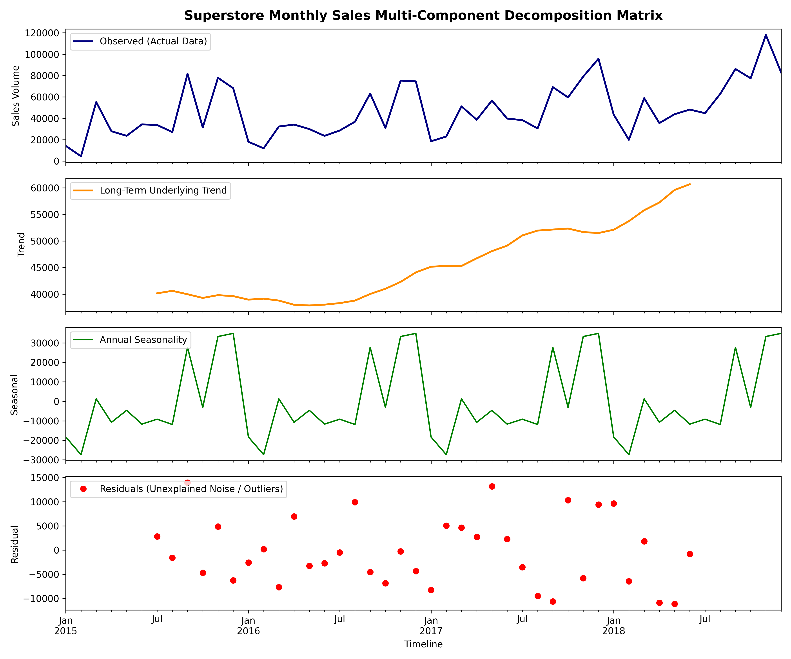
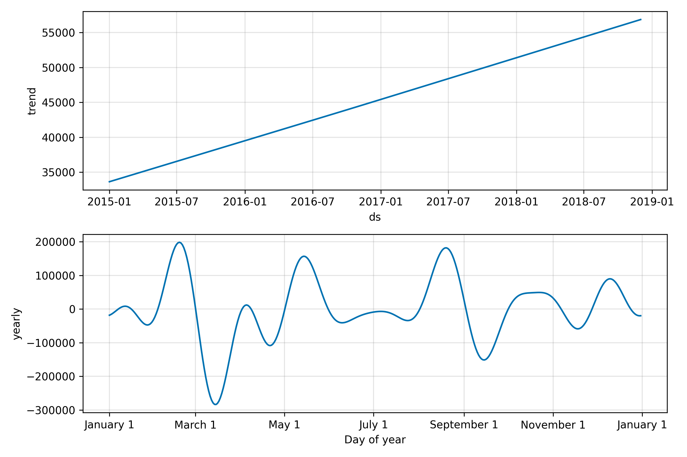
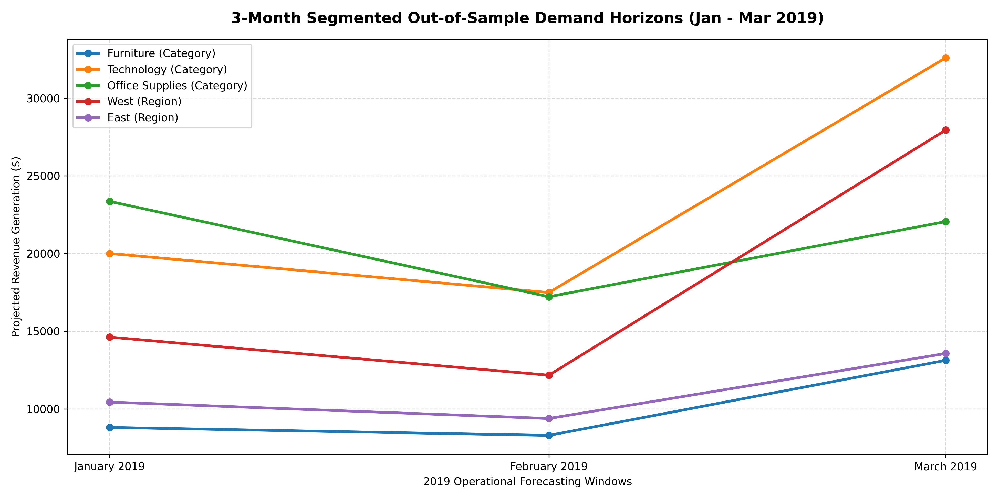
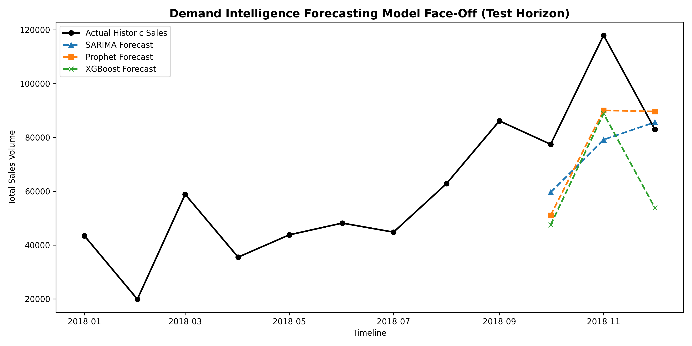
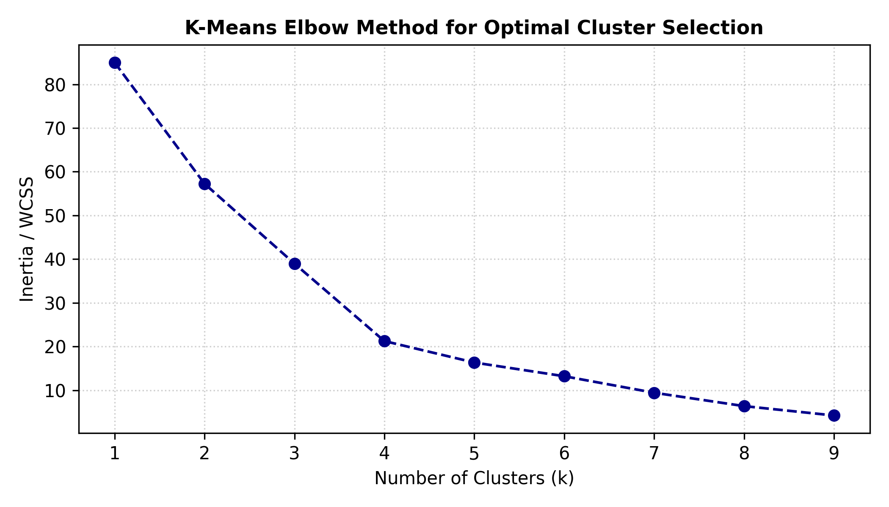
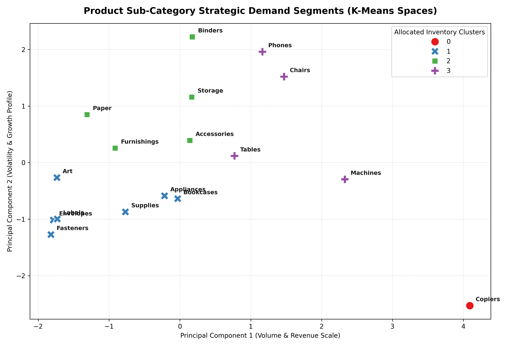
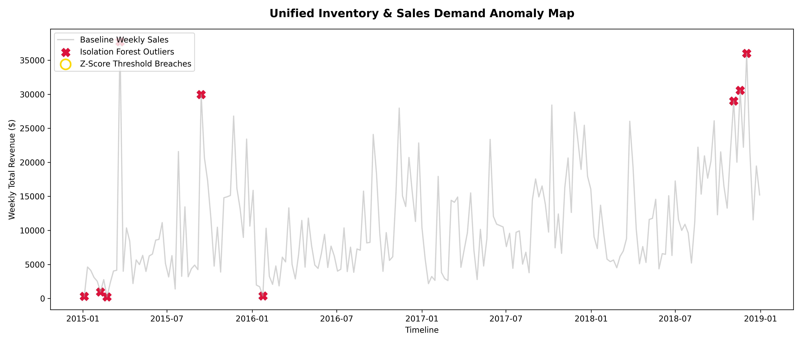

# Sales Forecasting & Demand Intelligence

A data-driven sales forecasting project that combines exploratory analysis, time series decomposition, statistical forecasting, machine learning, and anomaly detection to turn historical sales data into actionable business intelligence.

## Project Overview

This repository analyzes retail sales performance using a combination of:

- Deep exploratory data analysis
- Monthly and weekly sales aggregation
- Time series decomposition
- Stationarity testing
- Forecasting with SARIMA, Prophet, and XGBoost
- Segmented demand forecasting by category and region
- Anomaly detection and operational insights

The notebook also generates charts that are saved in the `charts/` folder and embedded below.

## Dataset

The project uses:

- `train.csv` — primary Superstore-style retail sales dataset
- `vgsales.csv` — supplementary external demand signal used for merged analysis

## Key Capabilities

- Revenue analysis by category and region
- Shipping delay analysis
- Seasonal trend discovery
- Time series forecasting
- Model comparison across multiple approaches
- Segment-level demand projections
- Detection of unusual sales patterns

## Notebook Workflow

The main analysis is contained in `analysis.ipynb` and is organized into the following tasks:

1. **Data Loading, Merging & Deep Exploration**
2. **Time Series Analysis & Decomposition**
3. **Model Training & Comparison**
4. **Segment Level Demand Forecasting**
5. **Multi-Method Anomaly Detection**

## Forecasting Results

The notebook compares three forecasting approaches:

- **SARIMA**
- **Prophet**
- **XGBoost**

Based on the notebook output, SARIMA delivered the strongest overall balance of forecasting error and interpretability for the main monthly series.

## Charts / Output Images

### Time Series Decomposition



### Prophet Components



### Segmented Forecasts



### Actual vs Predicted



### Clustering Elbow Curve



### Product Demand Clusters



### Anomaly Detection Map



## Main Insights

- **Technology** is the highest-revenue category.
- The **East** region shows strong and consistent revenue growth.
- Average shipping time is stable at around **4 days** across regions.
- Sales show clear seasonality, with spikes around **September, November, and December**.
- Segment forecasts indicate strong demand growth in **Technology** and the **West** region.

## How to Run

1. Clone the repository.
2. Install dependencies:

```bash
pip install -r requirements.txt
```

3. Open and run the notebook:

```bash
jupyter notebook analysis.ipynb
```

Or run the app script if applicable:

```bash
python app.py
```

## Repository Structure

```text
.
├── analysis.ipynb
├── app.py
├── charts/
├── requirements.txt
├── train.csv
└── vgsales.csv
```

## Requirements

Main dependencies include Python libraries for:

- data analysis
- visualization
- forecasting
- machine learning

See `requirements.txt` for the exact list.

## Author

Created for sales forecasting and demand intelligence analysis.
